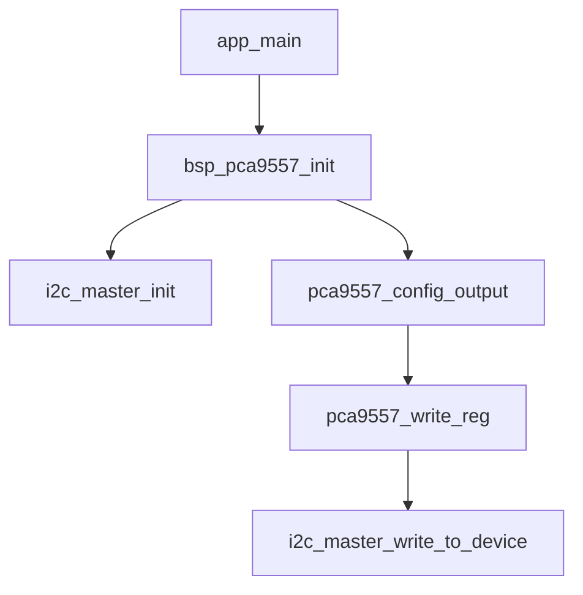
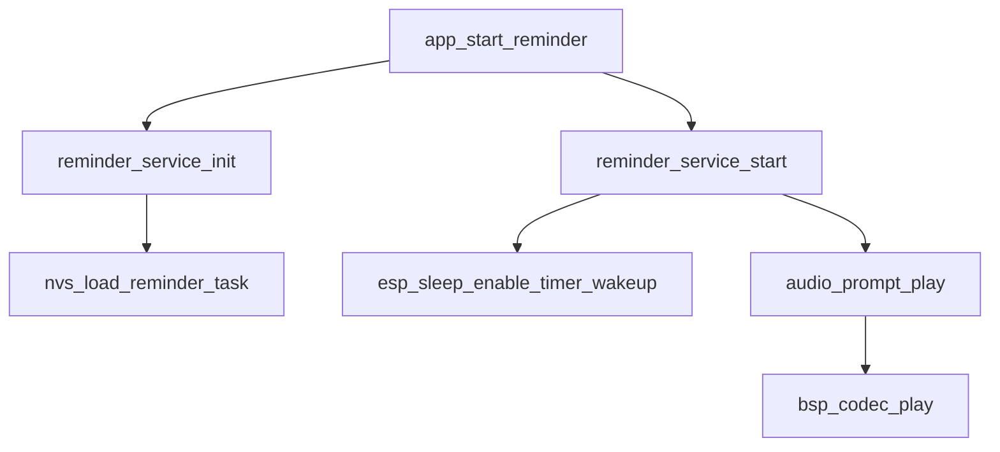
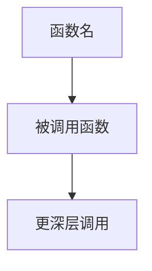
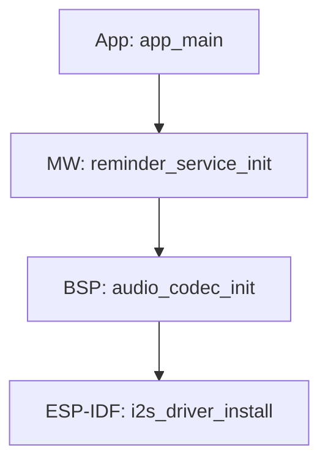
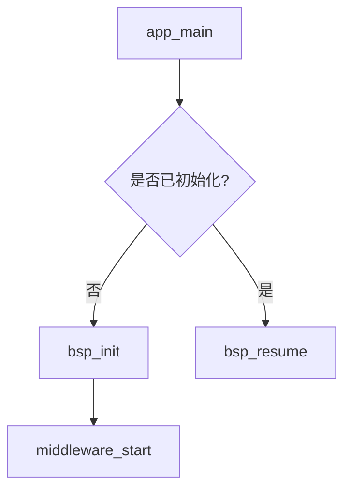
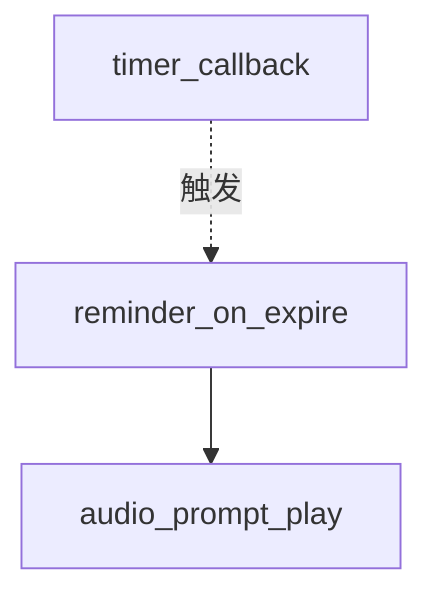

# 二十一、调用链追踪与 Call_chain.md 维护规则

每次阅读、新增、修改或删除代码时，必须在项目根目录维护 `Call_chain.md`，记录受影响的代码调用逻辑。

---

## 文件位置

```text
<项目根目录>/Call_chain.md
```

如果文件不存在，则创建；如果已存在，则在对应章节追加或更新，不要覆盖已有内容。

---

## 文档整体结构

```markdown
# Call Chain - xiaozhi-esp32

> 本文档记录项目中各功能模块的代码调用链，随代码变更同步更新。

---

## 模块名称（如：pca9557 IO 扩展驱动）

### 调用流程图



### 调用链表

| 调用顺序 | 函数 / 方法 | 所在文件路径 | 说明 |
|----------|-------------|-------------|------|
| 1 | `app_main` | `main/main.c` | 应用入口 |
| 2 | `bsp_pca9557_init` | `bsp/pca9557/pca9557.c` | BSP 层初始化 |
| 3 | `i2c_master_init` | `bsp/pca9557/pca9557.c` | I2C 总线初始化 |
| 4 | `pca9557_config_output` | `bsp/pca9557/pca9557.c` | 配置输出方向 |
| 5 | `pca9557_write_reg` | `bsp/pca9557/pca9557.c` | 寄存器写操作 |
| 6 | `i2c_master_write_to_device` | `ESP-IDF driver` | 底层 I2C 写 |

---

## 另一个模块（如：提醒服务）

### 调用流程图



### 调用链表

| 调用顺序 | 函数 / 方法 | 所在文件路径 | 说明 |
|----------|-------------|-------------|------|
| 1 | `app_start_reminder` | `main/app_reminder.c` | 提醒服务启动入口 |
| 2 | `reminder_service_init` | `middleware/reminder_service/reminder_service.c` | 中间件初始化 |
| ... | ... | ... | ... |
```

---

## 何时更新 Call_chain.md

### 必须更新的触发条件

| 操作类型 | 更新行为 |
|----------|---------|
| **阅读代码** | 如果理解了某功能的完整调用链，主动记录到文档（用户同意时） |
| **新增代码** | 为新功能增加新的模块章节，含流程图和调用链表 |
| **修改代码** | 更新受影响模块的调用链，标注变更点 |
| **删除代码** | 从调用链中移除已删除节点，标注"已移除"或直接删除 |
| **驱动迁移** | 记录从例程适配到 BSP/middleware 的完整调用路径 |

### 不需要更新的情况

- 仅修改注释、格式化、日志 TAG 名称等不影响调用逻辑的变更
- 仅修改 CMake 依赖声明（除非组件调用关系发生变化）

---

## Mermaid 流程图规范

### 基本语法



### 节点命名规则

- 节点 ID 使用字母（A、B、C...），避免与函数名冲突
- 节点标签写函数名，简洁即可，例如 `[bsp_pca9557_init]`
- 跨层调用可在标签中加层前缀：`[BSP: pca9557_init]`、`[MW: reminder_init]`

### 跨模块调用标注

当调用跨越 BSP / Middleware / App 层时，在节点标签中标注所属层：



### 条件分支标注

存在条件分支时使用菱形节点：



### 异步/回调调用标注

使用虚线箭头标注回调或中断触发：



---

## 调用链表规范

### 必填字段

| 字段 | 说明 |
|------|------|
| 调用顺序 | 数字序号，体现执行先后顺序 |
| 函数 / 方法 | 函数名，带模块前缀 |
| 所在文件路径 | 相对于项目根目录的路径，ESP-IDF 内部函数标注 `ESP-IDF driver` |
| 说明 | 该调用节点的职责，一句话描述 |

### 路径示例

```text
bsp/pca9557/pca9557.c
bsp/pca9557/include/pca9557.h
middleware/reminder_service/reminder_service.c
main/main.c
main/app_reminder.c
ESP-IDF driver（外部依赖，不在项目源码中）
```

---

## 更新时的操作流程

### 新增功能时

```text
1. 在 Call_chain.md 末尾追加新模块章节
2. 绘制 Mermaid 流程图（graph TD）
3. 填写调用链表（表格形式）
4. 在文件顶部更新日期注释
```

### 修改已有功能时

```text
1. 找到对应模块章节
2. 更新流程图中的受影响节点
3. 更新调用链表中的对应行
4. 如变更较大，在模块章节末尾追加变更说明：
   **变更说明（YYYY-MM-DD）**：修改了 xxx 节点，原因为 xxx
```

### 删除功能时

```text
1. 找到对应模块章节
2. 从流程图中移除相关节点和边
3. 从调用链表中删除对应行，或标注"已移除"
4. 如整个模块已删除，在章节标题后追加"（已废弃）"
```

### 阅读代码时（可选记录）

```text
1. 理解了某功能的调用链后，询问用户是否需要记录
2. 如用户同意，按新增功能格式写入
3. 标注"阅读记录"而非"代码变更"
```

---

## 文件顶部日期注释格式

每次更新后，在文件顶部维护更新记录：

```markdown
> 最后更新：YYYY-MM-DD
> 更新内容：新增 xxx 模块调用链 / 更新 xxx 调用链 / 移除 xxx 模块
```

---

## 禁止行为

1. 不得在未完成调用链分析的情况下凭空填写调用关系
2. 不得遗漏跨层调用（如 App 直接调用 BSP 绕过 Middleware）
3. 不得在 Mermaid 图中使用 `classDef`、`style`、`fill` 等样式语法
4. 不得将多个无关模块合并到同一章节
5. 不得删除与当前变更无关的已有调用链内容
6. 不得在流程图节点中使用中文括号或特殊字符，保持函数名原样
